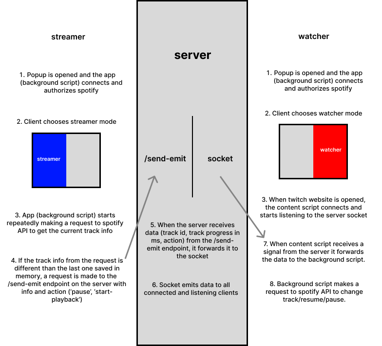

# Spotify Listen Along
Application (Node.js server + React client(chromium extension)) allowing multiple people (watchers) to listen along to one spotify playback controlled by one person (streamer).
## How does it work

## Prerequisites:
<ul>
  <li>node installed</li>
  <li>npm installed</li>
  <li>chromium browser</li>
  <li>spotify premium account</li>
  <li>application registered in "Spotify for Developers"</li>
</ul>

## Installation:

1. Run ```npm install``` in the main directory. This will install node modules for the server. To start the server - run ```node index.js```.
2. Follow the instructions in the ```./sla-chromium-client/README.md```. Omit point 2 of these instructions. This will give you the client side extension to load into your browser.

## Usage:
Register an application in ```developer.spotify.com```. You have to allow users access to your app in development mode (under 'users and access') and set redirect URI in settings (```https://[your chrome extension identifier].chromiumapp.org/```).
Once you set up your spotify application you can paste your apps Client ID into ```./sla-chromium-client/src/pages/Background/modules/spotifyWatcher.js``` into the CLIENT_ID variable.
In the browser, open the extension popup and click on either the streamer or the watcher side. If you're a watcher - for the socket connection to work, you've got to have a twitch.tv tab open.