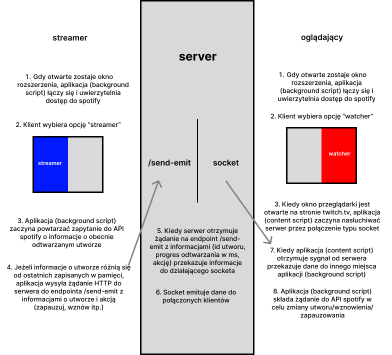

[](https://github.com/ukashu/sla-public/blob/main/README.md)
# Spotify Listen Along
Aplikacja (serwer Node.js + Klient React(rozszerzenie chromium)) dająca możliwość słuchania spotify w grupie przez internet.
## Schemat działania

## Wymagania:
<ul>
  <li>node</li>
  <li>npm</li>
  <li>przeglądarka chromium</li>
  <li>konto spotify premium</li>
  <li>aplikacja zarejestrowana w "Spotify for Developers"</li>
</ul>

## Instalacja:

1. Uruchom skrypt ```npm install``` w folderze głównym. To zainstaluje zależności serwera Node.js. Aby włączyć serwer uruchom skrypt ```node index.js```.
2. Aby uruchomić rozszerzenie w przeglądarce podążaj za instrukcjami instalacji w pliku ```./sla-chromium-client/README.md```. Pomiń punkt drugi instrukcji.

## Używanie:
Zarejestruj aplikację w ```developer.spotify.com```. Musisz dać użytkownikom dostęp do swojej aplikacji w trybie "development" (w sekcji 'users and access') oraz dodać URI przekierowania (```https://[id rozszerzenia chromium].chromiumapp.org/```) w sekcji 'settings'.
W pliku ```./sla-chromium-client/src/pages/Background/modules/spotifyWatcher.js``` jako zmienna CLIENT_ID wprowadź Client ID swojej aplikacji. W przeglądarce otwórz okno rozszerzenia i kliknij na "watcher" jeżeli chcesz by ktoś inny kontrolował utwory odtwarzane w Spotify, lub na "streamer" jeżeli chcesz kontrolować utwory odtwarzane przez innych. Jeżeli wybrany został tryb "watcher" musisz mieć otwartą stronę twitch.tv w którejś z zakładek przeglądarki aby połączenie z serwerem działało. 